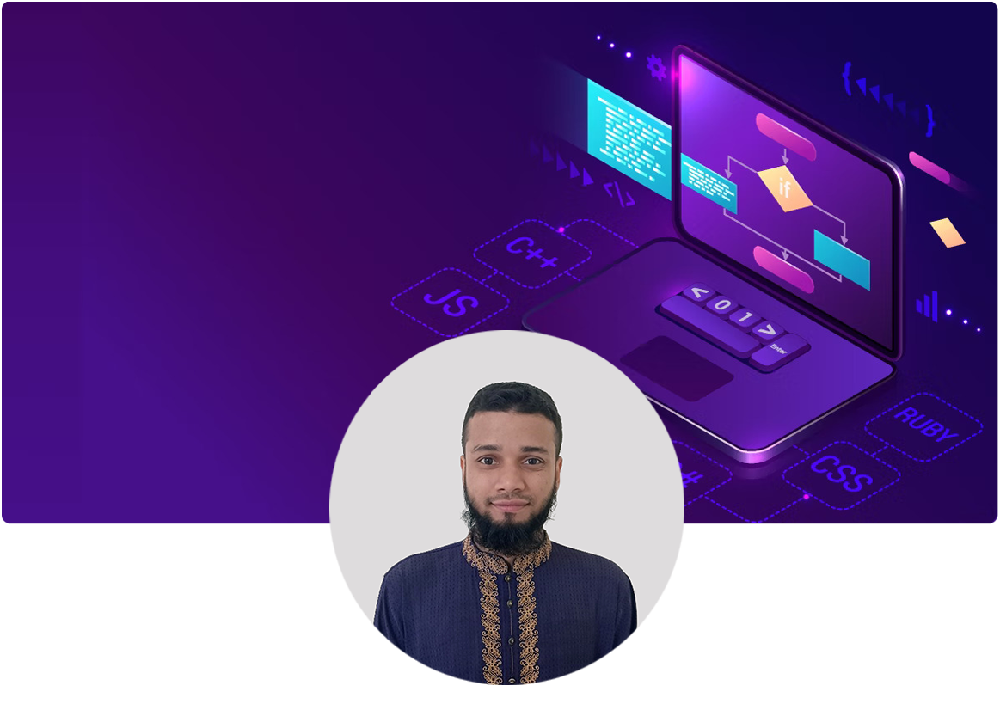

<div align="center">
    
</div>

[](https://git.io/typing-svg)

# 👨‍💻 About Me

#### Team Lead & Senior Coding Instructor at [Codingal Inc.](https://www.codingal.com/), with a strong background in frontend engineering, modern web technologies, technical mentoring, and learner development.

I specialize in building scalable and maintainable web applications using modern JavaScript technologies, with a strong focus on **React, Next.js, TypeScript, frontend architecture, performance optimization, and clean code practices**.

Beyond development, I work closely with educators and learners, helping teams improve technical delivery, teaching quality, problem-solving approaches, and overall engineering practices.

> 🚀 **Build. Lead. Mentor. Learn. Repeat.**

---

# 🎯 2026 Professional Focus

### 👨‍💼 Leadership & Engineering

* Team Leadership & Technical Mentoring
* Frontend Architecture & Design Patterns
* Code Quality & Engineering Standards
* Technical Documentation & Knowledge Sharing
* Performance Optimization
* Scalable Application Development
* Developer & Instructor Enablement

### 🌱 Current Learning & Exploration

* **Advanced Next.js**
* **Advanced TypeScript**
* **GraphQL & API Architecture**
* **Prisma & Modern ORM Patterns**
* **Docker & Containerized Applications**
* **AWS Cloud Fundamentals**
* **System Design & Distributed Systems Basics**
* **React Native & Cross-Platform Development**
* **Advanced Backend Architecture**
* **Testing & CI/CD**
* **AI-assisted Software Development**

### 🔭 Future Learning Opportunities

My long-term learning roadmap is focused on progressing from strong frontend expertise toward **full-stack engineering, cloud architecture, and technical leadership**.

**Next Areas of Focus:**

`Advanced System Design` → `Cloud Architecture` → `Scalable Backend Systems` → `DevOps & CI/CD` → `Microservices` → `Distributed Systems` → `Technical Leadership`

---

# 💼 Professional Expertise

### 🧑‍💻 Engineering

* Modern Frontend Development
* React & Next.js Applications
* TypeScript Development
* REST API Integration
* Backend Development with Node.js
* Database Integration
* Authentication & Authorization
* Responsive & Accessible UI
* Performance Optimization
* Reusable Component Architecture

### 👨‍🏫 Education & Mentoring

* Coding Instruction
* Technical Mentoring
* Curriculum & Learning Support
* Instructor Development
* Code Review & Feedback
* Project-Based Learning
* Technical Communication
* Team Collaboration
* Learner Progress Analysis

### 👥 Leadership

* Team Coordination
* Technical Guidance
* Mentorship & Coaching
* Process Improvement
* Quality Assurance
* Knowledge Sharing
* Performance Feedback
* Engineering Best Practices

---

# 💻 Technologies & Skill Stack

## ⚡ Frontend

| HTML                                                                                                                      | CSS                                                                                                                     | Tailwind                                                                                   | JavaScript                                                                                                                 | React                                                                                               | Next.js                                                                          | Redux                                                                                               | TypeScript                                                                                                    | MUI                                                                                                           |
| ------------------------------------------------------------------------------------------------------------------------- | ----------------------------------------------------------------------------------------------------------------------- | ------------------------------------------------------------------------------------------ | -------------------------------------------------------------------------------------------------------------------------- | --------------------------------------------------------------------------------------------------- | -------------------------------------------------------------------------------- | --------------------------------------------------------------------------------------------------- | ------------------------------------------------------------------------------------------------------------- | ------------------------------------------------------------------------------------------------------------- |
|  |  |  |  |  |  |  |  |  |

## ⚡ Backend

| Node.js                                                                                               | Express                                                        | MongoDB                                                                                                 | Firebase                                                                             |
| ----------------------------------------------------------------------------------------------------- | -------------------------------------------------------------- | ------------------------------------------------------------------------------------------------------- | ------------------------------------------------------------------------------------ |
|  |  |  |  |

## ⚡ Currently Exploring

| GraphQL                                                                                              | Prisma                                                                                                | Docker                                                                                                | AWS                                                        | React Native                                                                                        |
| ---------------------------------------------------------------------------------------------------- | ----------------------------------------------------------------------------------------------------- | ----------------------------------------------------------------------------------------------------- | ---------------------------------------------------------- | --------------------------------------------------------------------------------------------------- |
|  |  |  |  |  |

## ⚡ Tools & Workflow

| Git                                                                                             | Figma                                                                                               | Photoshop                                                                                 | Illustrator                                                                                      | Vercel                                                        | VS Code                                                                                                   | GitHub                                                                                                    | Bash                                                                                                    | Regex                                                                                                    | PowerShell                                                                           |
| ----------------------------------------------------------------------------------------------- | --------------------------------------------------------------------------------------------------- | ----------------------------------------------------------------------------------------- | ------------------------------------------------------------------------------------------------ | ------------------------------------------------------------- | --------------------------------------------------------------------------------------------------------- | --------------------------------------------------------------------------------------------------------- | ------------------------------------------------------------------------------------------------------- | -------------------------------------------------------------------------------------------------------- | ------------------------------------------------------------------------------------ |
|  |  |  |  |  |  |  |  |  |  |

---

# 🏢 Professional Journey

### 👨‍💼 Team Lead & Senior Coding Instructor

**Codingal Inc.**

Focused on combining **technology, education, leadership, and mentorship** to create better learning experiences and stronger technical teams.

My work involves:

* Leading and supporting technical teams
* Mentoring coding instructors
* Improving instructional quality and technical delivery
* Supporting project-based coding education
* Reviewing technical work and providing actionable feedback
* Helping learners develop practical programming skills
* Promoting clean coding and engineering best practices

---

# 🧠 Engineering Philosophy

```text
Learn deeply.
Build consistently.
Write maintainable code.
Solve problems systematically.
Share knowledge.
Lead by example.
Keep improving.
```

I believe strong engineers are not defined only by the technologies they know, but by their ability to **understand problems, design solutions, communicate clearly, collaborate effectively, and continuously learn**.

---

# 🚀 2026 → Future Roadmap

```text
Frontend Engineering
        ↓
Full-Stack Development
        ↓
Backend Architecture
        ↓
Cloud & DevOps
        ↓
System Design
        ↓
Scalable Distributed Systems
        ↓
Technical Leadership
```

### Long-Term Goals

* Become a stronger **Full-Stack Engineer**
* Develop expertise in **System Design**
* Build and operate **cloud-native applications**
* Improve knowledge of **distributed systems**
* Explore **microservices architecture**
* Strengthen **DevOps & CI/CD practices**
* Build production-grade SaaS applications
* Contribute more actively to **open-source projects**
* Continue growing as a **technical leader and mentor**

---

# 🤝 Open to Collaboration

I'm interested in collaborating on:

* 🌐 Open-Source Projects
* 🚀 SaaS Products
* ⚛️ React & Next.js Applications
* 🏗️ Frontend Architecture
* 🧩 Full-Stack Projects
* ☁️ Cloud & Backend Engineering
* 👨‍🏫 Developer Education
* 🧠 Technical Mentoring
* 💡 Innovative Learning Platforms

---

# 🌐 Connect With Me

<div align="left">
  <a href="https://www.linkedin.com/">
    
  </a>
  
  
  
  
  
</div>

---

# 📊 GitHub Performance Metrics

<div align="center">


</div>

---

<div align="center">

### 💚 Keep Learning. Keep Building. Keep Leading.

*"The best investment an engineer can make is in continuous learning."*

</div>
